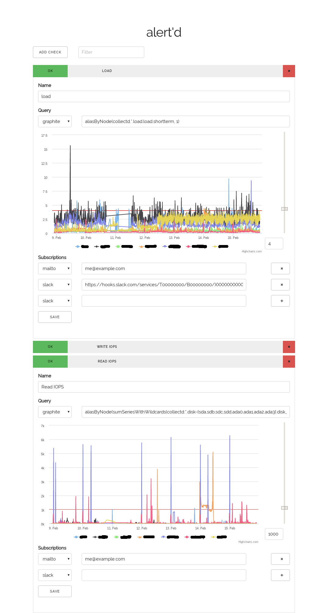

# alert'd - a simple alerting daemon

## data sources

At the moment alert'd supports graphite.

## configurable notification channels

Notification channels can be added through configurable shell commands.

```js
"notification_channels": [
  {
    "name": "mailto",
    "#": "The following environment variables are available NAME, SUBJECT, MESSAGE, DATA_SOURCE, QUERY, THRESHOLD, SERIE, and VALUE.",
    "#": "RECIPIENT is configured per subscription",
    "#": "MESSAGE is also piped via stdin",
    "command": "mail -s \"$SUBJECT\" \"$RECIPIENT\""
  },
  {
    "name": "slack",
    "command": "curl -fsS --header 'Content-type: application/json' --data \"{\\\"text\\\": \\\"$MESSAGE\\\"}\" \"$RECIPIENT\""
  }
],
```

## simple message and subject templates

Using shell-like `$VAR` and `${VAR}` string interpolation.

```js
  "#": "The subject and message templates.",
  "#": "All variables except for SUBJECT, MESSAGE, and RECIPIENT are available.",
  "subject_template": "$NAME check failed for $SERIE",
  "message_template": "$SUBJECT: value $VALUE > threshold $THRESHOLD.\n$DATA_SOURCE: $QUERY\n",
```

## installation

Almost no dependencies, just download and run.

```sh
curl -fsSL https://github.com/MartinNowak/alertd/releases/download/v0.1.0/alertd-0.1.0-linux-x86_64.tar.xz | tar -Jxf -
cd alertd-0.1.0-linux-x86_64
cp alertd.sample.json alertd.json
vi alertd.json
./alertd
```


